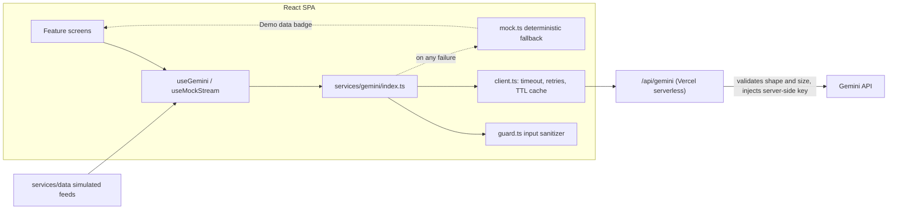

# Stadeck

[](https://github.com/AbhyudayPS01/stadeck/actions/workflows/ci.yml)

GenAI-powered stadium operations and fan experience platform built to enhance the overall tournament experience for fans, organizers, volunteers, and venue staff.

The FIFA World Cup 2026 spans 16 venues across the USA, Canada, and Mexico, with fans arriving from around the globe speaking many languages. Stadeck serves this entire tournament and its global audience through multi-venue intelligence and native multilingual support.

**Live demo:** _deployment link pending final submission_

<!-- Screenshots: capture at 375px (Navigation, fan), 768px (Crowd Management, staff), 1440px (Operational Intelligence, organizer), plus the landing role gate. -->

## Problem Statement Alignment

The challenge:

> "Build a GenAI-enabled solution that enhances stadium operations and the overall tournament experience for fans, organizers, volunteers, or venue staff. The solution must leverage Generative AI to improve navigation, crowd management, accessibility, transportation, sustainability, multilingual assistance, operational intelligence, or real-time decision support during the FIFA World Cup 2026."

Stadeck implements all eight clauses as eight modules, named exactly after the clause they serve:

| Challenge clause           | Module                     | Route                         | Key file                                                                     |
| -------------------------- | -------------------------- | ----------------------------- | ---------------------------------------------------------------------------- |
| improve navigation         | Navigation                 | `/navigation`                 | `src/features/navigation/NavigationScreen.tsx`                               |
| crowd management           | Crowd Management ★         | `/crowd-management`           | `src/features/crowd-management/CrowdManagementScreen.tsx`                    |
| accessibility              | Accessibility              | `/accessibility`              | `src/features/accessibility/AccessibilityScreen.tsx`                         |
| transportation             | Transportation             | `/transportation`             | `src/features/transportation/TransportationScreen.tsx`                       |
| sustainability             | Sustainability             | `/sustainability`             | `src/features/sustainability/SustainabilityScreen.tsx`                       |
| multilingual assistance    | Multilingual Assistance ★  | `/multilingual-assistance`    | `src/features/multilingual-assistance/MultilingualAssistanceScreen.tsx`      |
| operational intelligence   | Operational Intelligence   | `/operational-intelligence`   | `src/features/operational-intelligence/OperationalIntelligenceScreen.tsx`    |
| real-time decision support | Real-Time Decision Support | `/real-time-decision-support` | `src/features/real-time-decision-support/RealTimeDecisionSupportScreen.tsx`  |

★ = flagship module, built deepest:

- **Multilingual Assistance** — Gemini detects the fan's language from their message, answers in that language grounded in a verified stadium fact sheet, and translates live venue announcements on demand.
- **Crowd Management** — Gemini reads an aggregated live occupancy sweep (96 sections + 8 gates) and produces gate-opening recommendations, steward redeployment moves, and a 30-minute congestion forecast over a density heatmap.
- **Real-Time Decision Support** — Gemini turns each reported incident into a structured action plan (ordered immediate actions, teams to notify, escalation criteria, priority), plus an organizer "what-if" scenario planner using the same contract.

**User context.** Fans use Stadeck on phones inside the venue — standing on a concourse, one-handed, often on congested connectivity — so the fan experience is built mobile-first. Volunteers and venue staff (stewards, ground staff, security/police liaison, gate/concourse staff) work on tablets while moving through the crowd, so the ops (dark) theme is touch-optimised: the stadium map guarantees ≥44px gate touch targets and gap-free section hit bands at every breakpoint. Organizers sit at desks with large displays, so their views (Operational Intelligence, the scenario planner) are data-dense KPI layouts. This reality — not a stylistic preference — drove the mobile-first responsive implementation: the schematic map reduces label density rather than shrinking text below 12px on small screens, and every layout is verified at phone, tablet, and desktop widths. The design responds to where each user actually is during a match.

## Architecture



One-way data flow: feature screens call typed functions on `services/gemini/index.ts` (never `fetch` directly). Each call sanitizes input (`guard.ts`), builds a prompt (`prompts.ts`), goes through the caching/retrying client (`client.ts`) to the serverless proxy (`api/gemini.ts`), and validates the JSON reply against a shape guard (`validators.ts`). Any failure at any stage — offline, no key, rate limit, malformed output — transparently serves the deterministic mock (`mock.ts`) and marks the UI with a "Demo data" badge. The app is fully functional with zero API key.

## GenAI usage

| Feature                    | What Gemini does                                                              | Prompt design notes                                                                                                          |
| -------------------------- | ----------------------------------------------------------------------------- | ----------------------------------------------------------------------------------------------------------------------------- |
| Navigation                 | Turn-by-turn walking directions from a chosen gate to a section               | Fully structured input from map config (no free text); grounded in computed real landmarks (nearest restroom/food/exit)       |
| Crowd Management           | Gate/steward recommendations + congestion forecast                            | Sensor sweep compacted to aggregates + hottest zones to stay under the proxy payload cap; strict JSON contract                 |
| Accessibility              | Step-free route guidance; plain-language announcement rewrites                | Structured endpoints for routes; announcement text delimiter-wrapped as untrusted feed data                                    |
| Transportation             | Personalized departure strategy with concrete times and load levels           | Live transit board embedded as JSON; fan's destination wrapped by the injection guard                                          |
| Sustainability             | Per-fan eco-actions; organizer match report                                   | Both grounded in the live metrics snapshot; separate JSON contracts per audience                                               |
| Multilingual Assistance    | Language auto-detection, fact-grounded replies, announcement translation      | Grounded in a local fact sheet with an explicit "say so if the facts don't cover it" instruction; user text delimiter-wrapped  |
| Operational Intelligence   | Executive briefing: state of venue, anomalies, trends                         | KPI snapshot as JSON; strict `{ summary, anomalies, trends }` contract                                                         |
| Real-Time Decision Support | Structured incident action plans; what-if contingency plans                   | Shared action-plan JSON contract with an enum-validated priority; organizer scenario text delimiter-wrapped                    |

Every response is requested as JSON-only, parsed defensively (fence stripping, shape validation), and falls back to a deterministic mock on any mismatch — see `src/services/gemini/`.

## Security

The Gemini key never reaches the browser: the client talks only to a Vercel serverless proxy that validates request shape and size, injects the server-side key, and never echoes upstream errors. All free-text input passes an injection guard (length cap, control-character strip, delimiter wrapping); simulated "external" feeds are treated as untrusted on both the prompt path and the render path; AI output is validated against per-feature shape guards and rendered as plain text only. The Volunteer/Organizer role gate is a documented demo stand-in for venue SSO/OIDC. Full threat model: [SECURITY.md](SECURITY.md).

## Efficiency

- Route-level code splitting for all eight modules (`React.lazy` in `src/App.tsx`); the landing screen loads eagerly as the first paint.
- In-memory TTL response cache keyed by prompt hash plus a per-feature minimum-interval limiter (`src/services/gemini/client.ts`, `index.ts`).
- The memoized base map never re-renders on overlay updates — density heatmaps and route overlays are separate layers (`src/components/map/StadiumMap.tsx`).
- Debounced chat input (300ms), all intervals/listeners cleaned up on unmount, three pinned runtime dependencies (react, react-dom, react-router-dom; ~61KB gzipped vendor chunk), no date/utility libraries.

## Testing

- 413 tests across 64 co-located `*.test.ts(x)` files: 100% of `utils/`, the injection guard, every prompt builder, mock provider, response shape guard, the cache/limiter, and the proxy's validation logic, plus component tests for the chat send flow, role gate, map interaction, and every module's error/mock-fallback states.
- CI (`.github/workflows/ci.yml`): install → lint → typecheck → test → build on every push and PR; badge above.

## Accessibility

- Semantic landmarks, correct heading hierarchy, keyboard-reachable everything (including every map section and gate), visible focus states, `aria-live` on AI responses and live feeds.
- App-wide high-contrast toggle and text-size control, part of the Accessibility module (`src/context/DisplayPreferencesProvider.tsx`); type tokens are rem-based so the text scale applies everywhere.
- `prefers-reduced-motion` disables every animation, including the word-streaming chat effect (`src/hooks/useReducedMotion.ts`).
- Meaning is never color-only: the density heatmap pairs a hatch pattern and labeled legend with a text watchlist; badges carry glyph + word.

## Setup

```bash
git clone https://github.com/AbhyudayPS01/stadeck.git
cd stadeck
npm ci
cp .env.example .env        # add your GEMINI_API_KEY (optional — see below)
npx vercel dev              # runs the SPA + the /api/gemini serverless proxy
```

- **Zero-key demo mode:** without a `GEMINI_API_KEY` (or entirely offline, e.g. plain `npm run dev`), every AI feature serves deterministic mock responses and shows a "Demo data" badge — the full product is reviewable with no setup.
- **Demo access codes for judges:** Fan view is one click. Volunteer & Staff: `PITCH-CREW-2026`. Organizer: `FINAL-OPS-2026`. (These are demo view-selectors, not credentials — see SECURITY.md.)
- `npm run lint && npm run typecheck && npm test && npm run build` reproduces the CI gate locally.

## Tech stack

React 18 + Vite + TypeScript (strict) · Tailwind CSS with design tokens · React Router (lazy routes) · Vitest + React Testing Library · Gemini via a Vercel serverless proxy · ESLint + Prettier · MIT license.

## Future scope

Honest gaps between this demo and a production deployment:

- Real sensor feeds (occupancy, queues) replacing the simulated data providers in `src/services/data/`.
- Venue CMS integration for announcements, amenities, and the stadium layout config.
- Ticketing integration so Navigation starts from the fan's actual seat.
- Real SSO/OIDC for staff and organizer roles, with server-side authorization and per-user rate limiting at the proxy.
